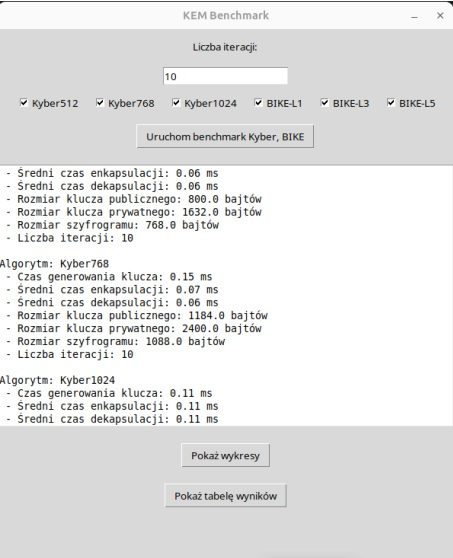
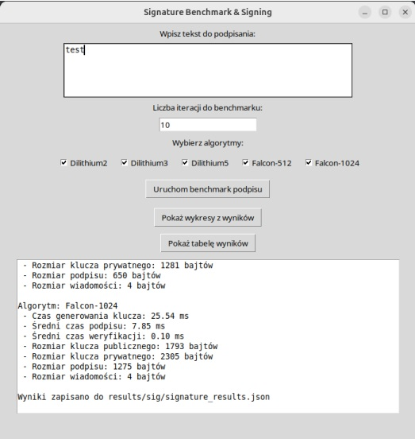

# PQC Benchmark: Post-Quantum Cryptography Analysis Tool

Aplikacja badawcza służąca do analizy wydajności i bezpieczeństwa algorytmów kryptografii post-kwantowej (PQC). Narzędzie umożliwia benchmarking mechanizmów, które są odporne na ataki przyszłych komputerów kwantowych.

Projekt skupia się na implementacji i testowaniu algorytmów rekomendowanych w procesie standaryzacji NIST.

## Galeria

| Konfiguracja Benchmarku | Analiza Wyników |
| :---: | :---: |
|  |  |
| *Okno wyboru algorytmów KEM* | *Okno wyboru algorytmów podpisu cyfrowego* |

---

## Kluczowe Funkcjonalności

Aplikacja pozwala na przeprowadzenie testów wydajnościowych (czas generowania kluczy, podpisu, weryfikacji) dla dwóch głównych grup algorytmów:

### 1. Key Encapsulation Mechanisms (KEM)
Mechanizmy bezpiecznej wymiany klucza. Zaimplementowane algorytmy:
* **CRYSTALS-Kyber** (Warianty: 512, 768, 1024) – oparty na kratach, algorytm charakteryzujący się dobrym balansem między szybkością a rozmiarem klucza.
* **BIKE** (Warianty: L1, L3, L5) – oparty na kodach, oferujący kompaktowe klucze.

### 2. Digital Signatures (Podpisy Cyfrowe)
Algorytmy uwierzytelniania:
* **CRYSTALS-Dilithium** (Warianty: 2, 3, 5) – wysoka wydajność, rekomendowany standard.
* **Falcon** (Warianty: 512, 1024) – najmniejsze rozmiary podpisu.

---

## Technologie i Architektura

Projekt opiera się na **Open Quantum Safe (liboqs)** – otwartej bibliotece C, która implementuje algorytmy odporne na ataki kwantowe. Wykorzystanie `liboqs` zapewnia zgodność z najnowszymi wytycznymi NIST.

* **Core Crypto Engine:** [`liboqs`](https://openquantumsafe.org/) – silnik kryptograficzny (backend w C).
* **Wrapper:** `liboqs-python` – integracja biblioteki z językiem Python.
* **Język:** Python 3.
* **GUI:** `Tkinter`.
* **Analiza:** `Matplotlib` (wizualizacja), `JSON` (dane).
